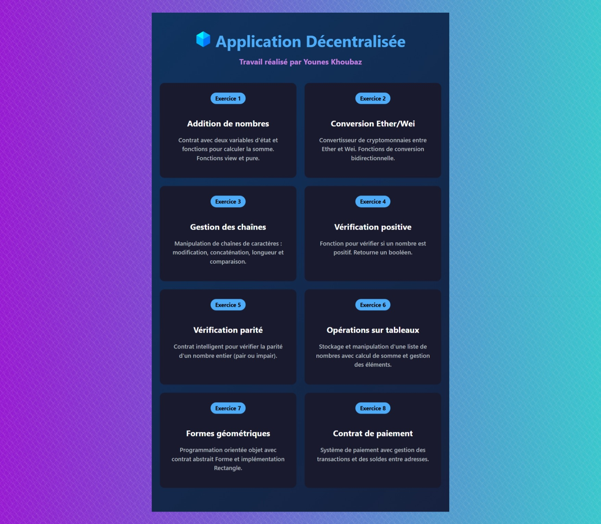
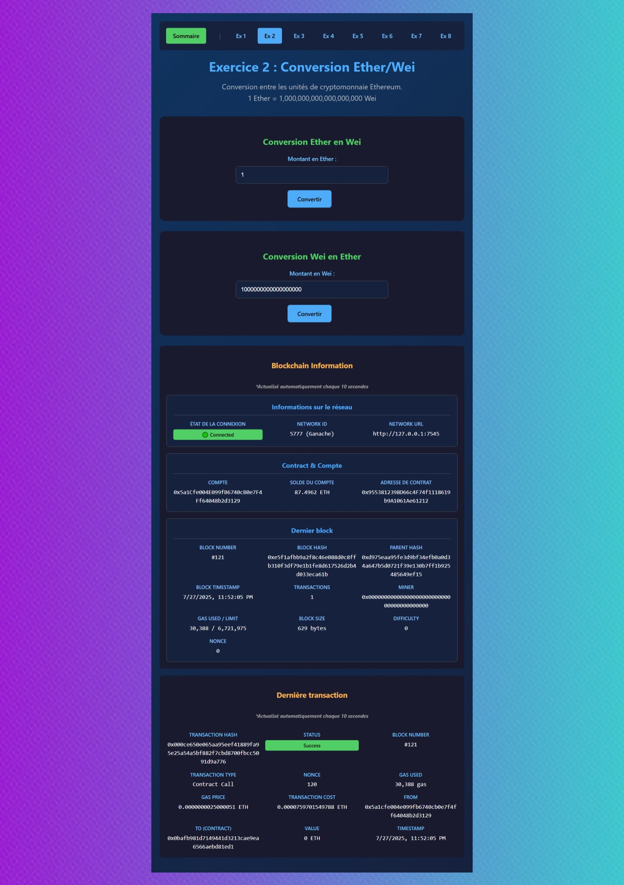

# Application décentralisée réalisée avec Truffle (Solidity), React (Typescript), Web3.js et aussi Ganache pour une blockchain de test 

## Page d'accueil

## Exemple de l'un des pages qui communique avec l'un des Smart Contracts

